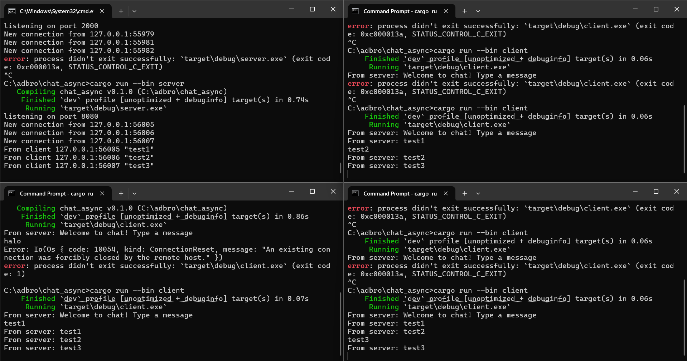

# Module 10: Asynchronous Programming - Tutorial 2: Broadcast Chat

## Experiment 2.1: Original code, and how it run

Untuk menjalankan aplikasi chat ini, pertama-tama saya menjalankan server di satu terminal:
```bash
cargo run --bin server
```
Server akan menampilkan listening on port 2000.

Kemudian, saya membuka tiga terminal terpisah lainnya dan di masing-masing terminal saya menjalankan client:

```bash
cargo run --bin client
```

Masing-masing client akan menampilkan Welcome to chat! Type a message.

Setelah itu, saya mencoba mengetikkan pesan di salah satu client. Misalnya, saya mengetik Selamat pagi! di Client 1. Hasilnya adalah pesan tersebut akan broadcast ke semua client yang terhubung, dan server juga akan mencatat pesan yang diterima.

Berikut adalah screenshot yang menunjukkan server dan tiga client, dengan pesan yang sudah dikirim dan diterima oleh semua:


Penjelasan:
Aplikasi ini menunjukkan konsep broadcast chat menggunakan WebSocket. Ketika sebuah client mengirim pesan, pesan tersebut dikirim ke server melalui koneksi WebSocket. Server kemudian menerima pesan tersebut dan menyebarkannya kembali ke semua client lain yang terhubung. Ini memanfaatkan sifat asynchronous dari WebSocket di mana komunikasi dua arah (full-duplex) dapat terjadi secara real-time tanpa harus melakukan polling terus-menerus. Setiap client dan server secara asinkron menunggu dan memproses event (pesan masuk atau keluar).

## Experiment 2.2: Modifying port

Saya mengubah port WebSocket dari `2000` menjadi `8080`. Perubahan ini perlu dilakukan di dua tempat agar client dan server dapat berkomunikasi pada port yang sama:

1.  **`src/bin/client.rs`**: Di sini, saya mengubah URI yang digunakan oleh `ClientBuilder` untuk terhubung ke server:
    ```rust
    ClientBuilder::from_uri(Uri::from_static("ws://127.0.0.1:8080"))
    ```
2.  **`src/bin/server.rs`**: Di sini, saya mengubah alamat yang di-bind oleh `TcpListener` untuk mendengarkan koneksi masuk:
    ```rust
    let listener = TcpListener::bind("127.0.0.1:8080").await?;
    ```
    Saya juga memperbarui pesan output server agar sesuai dengan port yang baru.

Aplikasi masih berjalan dengan benar setelah perubahan ini. Ini menegaskan bahwa protokol WebSocket (ws) digunakan untuk komunikasi, dan perubahan port hanya perlu disinkronkan antara kedua ujung koneksi (client dan server). Protokol `ws` didefinisikan sebagai bagian dari URI `ws://127.0.0.1:8080`.

